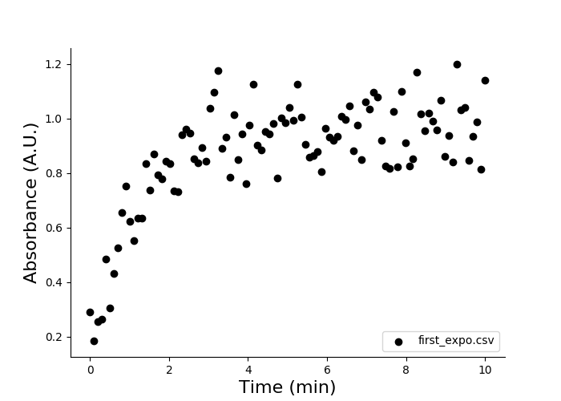
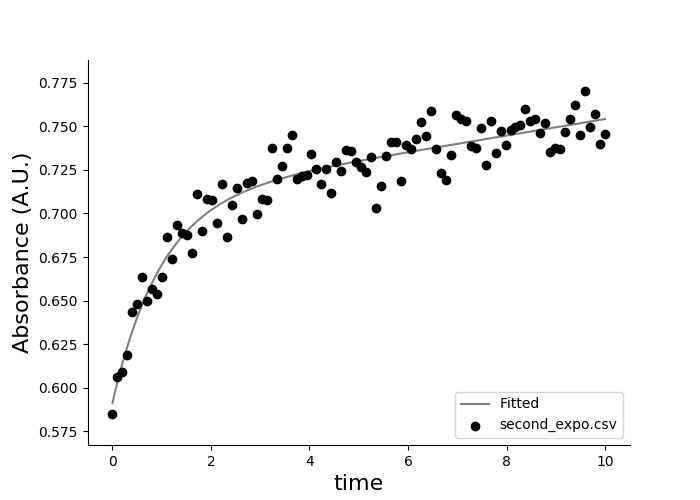

# easy-data-analysis: plotting and statistical analysis tools for scientific research

## Overview

This package provides tools to analyze scientific research data, with a focus on plotting and statistical analysis. It is written in Python and was tested on Linux and MacOS.

## Compatibility

This package is written in Python 3.6 and was tested on Linux and MacOS 13. It depends on the following libraries:
* matplotlib 3.1.3
* numpy 1.18.4
* pandas 0.25.3
* scipy 1.4.1

## Installation

If you are new to installation of Python and its packages, a [tutorial](https://packaging.python.org/tutorials/installing-packages/) is on the Python's website.

Installing Python libraries is most easily done with `pip3`, simply run in a terminal:
```
pip3 install --upgrade <library>
```

`easy-data-analysis` is packaged and available through [PyPI](https://pypi.org), you can install it by running in a terminal:
```
pip3 install --upgrade easy-data-analysis
```

Source distributions are also available here on GitHub, download the source and install it by running:
```
pip3 install <path>
```

## Command Line Interface

`easy-data-analysis` is accessible through a command line interface which follows this syntax:
```
eda <command> <subcommand> [arguments ...]
```

Type this in your terminal for more information:
```
eda --help
```

### `configure` command

```
eda configure <subcommand>
```

`configure` manages the default arguments of all commands, i.e. the behaviour of commands when you do not provide optional arguments.
Available subcommands:
* `spectrum`: configure `eda plot spectrum`
* `kinetics`: configure `eda plot kinetics`
* `default`: rollback to the original configuration (the one provided when you install this package)

When you enter the configuration mode, instructions will be displayed before you are prompted for input. The name of the parameter is displayed followed by its current value between ( parentheses ).
You have three possible actions (validate any of them by pressing \<Enter\>):
* keep the current value: leave the input field empty
* modify the current value: type your input (if a list is expected, use space to separate values)
* enter a void value (no value): enter 'none' (without quotes)

### `plot` command

```
eda plot <subcommand> [arguments ...]
```

`plot` reads a CSV file and plots the data according to one of the following subcommands:
* `spectrum`
* `kinetics`

#### `spectrum` subcommand

This subcommand plots absorption spectra.
```
eda plot spectrum [arguments ...]
```
File names are positional arguments, they should be passed before optional argument. Optional arguments include:
* `-l` or `--label` labels for the plot legend
* `--figure-size` width and height in inches
* `--xcolumn` name of the column containing x-axis values
* `--ycolumn` name of the column containing y-axis values
* `--xlabel` label on the x-axis
* `--ylabel` label on the y-axis
* `--xlimit` left and right values for x-axis limits
* `--ylimit` bottom and top values for y-axis limits
* `--skip-header` number of rows to skip at the beginning of the file
* `--legend-location` run `eda plot spectrum -h` for more information
* `--title` title of the plot

For example:
```
eda plot spectrum file1.csv file2.csv -l experiment1 experiment2
```

For more information:
```
eda plot spectrum -h
```

#### `kinetics` subcommand

This subcommand plots absorption kinetics curves. It can also plot an exponential model curve fitted on the data. Parameters of the model will be printed on the console.
```
eda plot kinetics [arguments ...]
```

File names are positional arguments and should be passed before optional arguments. Optional arguments include:
* `-l` or `--label` labels for the plot legend
* `-f` or `--fit` fit the data with a mathematical model
* `-m` or `--model` specify the mathematical model used to fit the data. Choices include:
	- `exp` (default) fit both first-order and second-order exponential models and selects the best
	- `exp1` fit a first-order exponential
	- `exp2` fit a second-order exponential
	- `linear` fit a linear model
* `--init-params` provide initial parameters for the curve-fitting algorithm
* `--skip-header` number of rows to skip at the beginning of the file
* `--xcolumn` name of the column containing x-axis values
* `--ycolumn` name of the column containing y-axis values
* `--xlabel` label on the x-axis
* `--ylabel` label on the y-axis
* `--xlimit` left and right values for x-axis limits
* `--ylimit` bottom and top values for y-axis limits
* `--figure-size` width and height in inches
* `--legend-location` run `eda plot spectrum -h` for more information
* `--title` title of the plot

For example:
```
eda plot kinetics file1.csv file2.csv -l experiment1 experiment2 -f
```

For more information:
```
eda plot kinetics -h
```

## Tutorials

You should do these two steps prior to the tutorial:
* install the `easy-data-analysis` package
* download the CSV data files from `eda/docs/`

### Plot a kinetics curve


Plotting a kinetics curve is done by providing the file names(s) to `eda plot kinetics`:
```
eda plot kinetics first_expo.csv
```

You should see this output:




You do not need to provide optional arguments because the format of `first_order.csv` matches the default configuration. Files with various formats can be dealt with by changing or reviewing the configuration by running `eda configure kinetics` or by providing arguments to `eda plot kinetics`.

Let's plot and fit `second_expo.csv`. This file contains no rows to be skipped (the first line contains column names).
```
eda plot kinetics second_expo.csv -f -m exp2 --xcolumn time --ycolumn absorbance --xlabel time --skip-header 0
```

You should see this output:



When fitting a curve you will be provided with fitting results:
```
second_expo.csv
y = a1 * exp(k1 * x) + a2 * exp(k2 * x)
------------------------------
Parameter      Value   Std Err
------------------------------
a1           -0.1169    0.0069
a2           +0.7081    0.0051
k1           -1.0201    0.1330
k2           +0.0063    0.0010
R-square     0.91967
t1 (sec)       40.77
t2 (sec)     6600.02
```

The first line is the file name, the second line is the equation of the data model. The following lines show the value and standard error of the parameters of the equation. The R-square value indicates the goodness of fit and varies from 0 (poor fit) to 1 (perfect fit). The parameters `t1` and `t2` are the doubling times (or halving times for exponential decay) of the first and second components of the equation. They are calculated as:

<a href="https://www.codecogs.com/eqnedit.php?latex=t_x=\frac{\ln2}{|k_x|}" target="_blank"></a>

`t1` and `t2` are shown in seconds and assume that you provide data in *minute* by default. If the time unit of your data is *second*, you can specify it by running `eda configure kinetics` and modify the parameter `time_unit` or by using the parameter `--time-unit` when calling `eda plot kinetics`.
